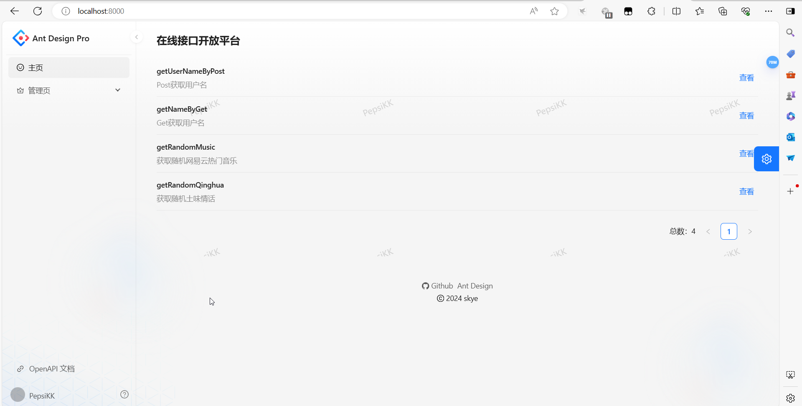
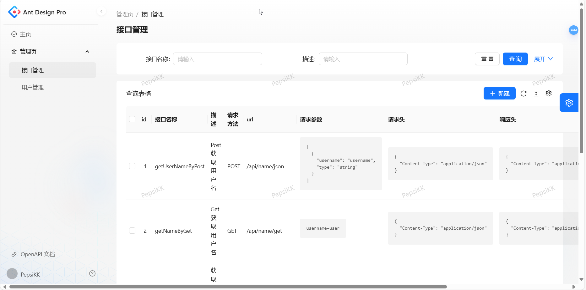
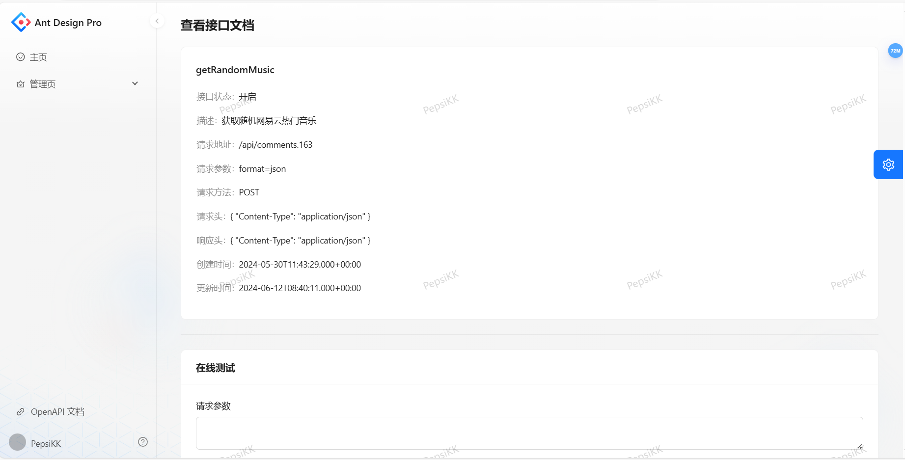
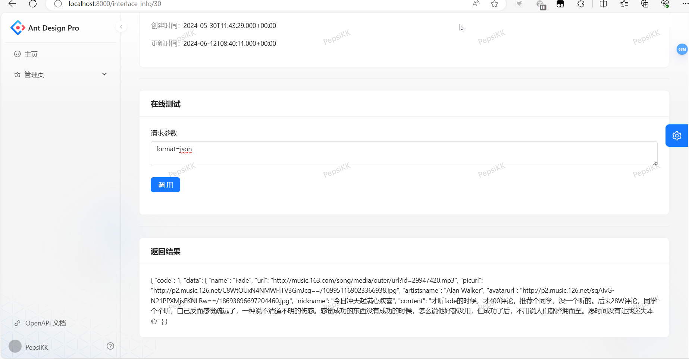

# skyeApi接口开放平台

## 项目介绍
一个可发布接口、在线调用接口、通过客户端SDK直接调用接口的API接口开放平台，基于 React + SpringBoot + Dubbo + Gateway 实现。

## 技术选型

### 后端
- Java Spring Boot框架
- MySQL数据库
- MyBatis-Plus及MyBatisX代码自动生成
- API签名认证
- Dubbo分布式（RPC、Nacos）
- Spring Cloud Gateway微服务网关
- Swagger + Knife4j借口文档生成
- Hutool、Apache Common Utils、Gson等工具类
### 前端
- React
- Ant Design Pro 脚手架
- OpenAPI前端代码生成

## 项目演示

## 重点
- 掌握微服务思想
- 代码生成技巧
- 架构设计
- 客户端SDK开发
- API签名认证
- API网关
- RPC分布式

